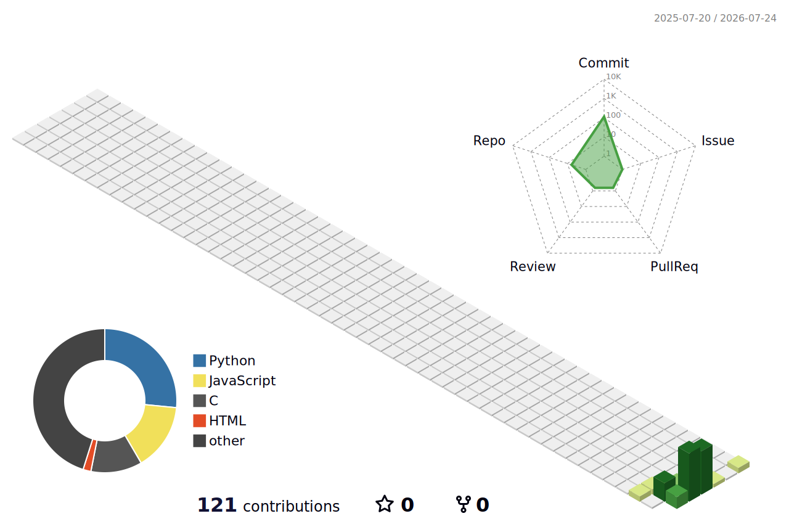

### Hi! I'M Debjeet 👋

Here are some ideas to get you started:

- 🔭 I’m currently working on leetcode problems
- 🌱 I’m currently learning java
- 👀 I’m looking to collaborate on open source projects
- 💬 Ask me about my tech journey
- 📫 How to reach me email [purakayasthadebjeet@gmail.com]
- 😄 Pronouns: he/him
- ⚡ Fun fact: Life is Easy!

  

  
  
  

 

